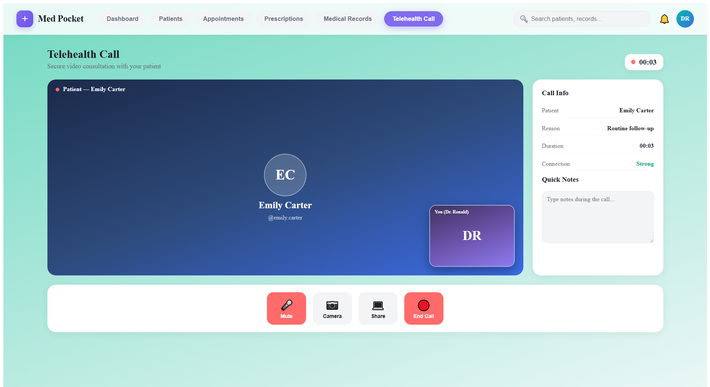
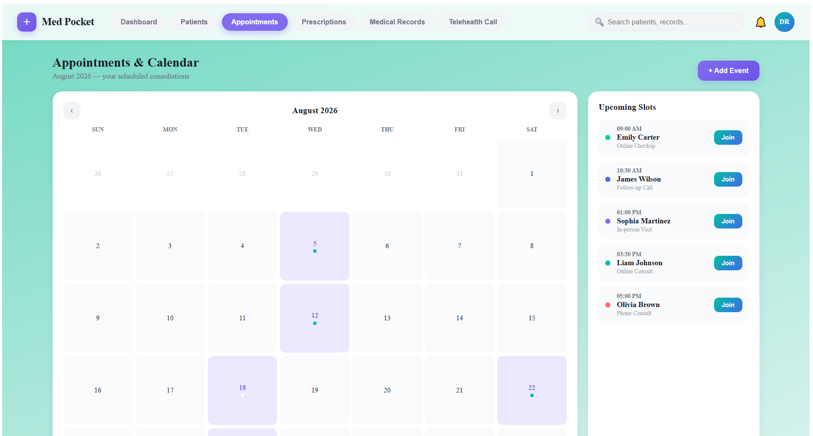
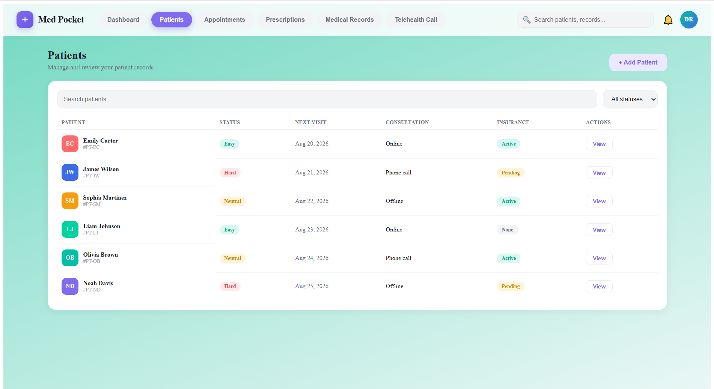
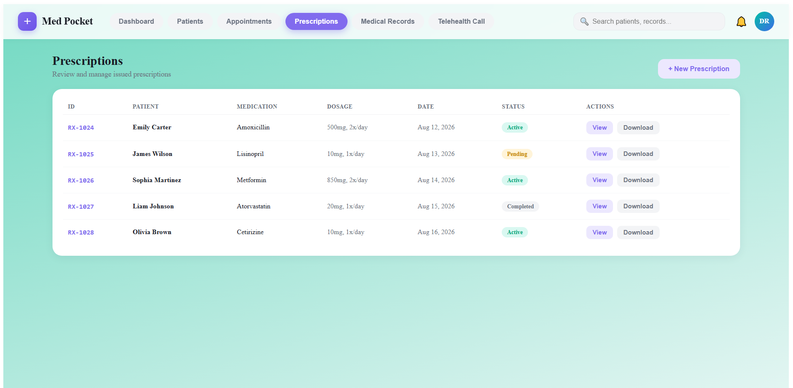

<div align="center">

# ⚡ Med Pocket App

### Next-Gen Telemedicine & Video Consultation Platform

A high-performance, feature-rich Telemedicine application built with Angular featuring real-time Picture-in-Picture video consultations, patient management, interactive appointment scheduling, lab reports, and a crisp mint-teal gradient aesthetic.


---

### ⭐ Telehealth & Clinical Workspace Project

</div>

---

# 📸 Project Preview

## Dashboard & Clinical Workspace


---

## Telehealth Consultation & PiP Video Streams



---

## Interactive Consultation Calendar & Appointments



---

## Patient Management & Medical Records



---

## Digital Prescriptions & Lab Reports



---

# ✨ Features

### Telehealth & Virtual Consultations
- **Picture-in-Picture (PiP) Video Call Screen**: Seamless dual-stream video interface allowing doctors and patients to view each other concurrently.
- **In-Call Toolbar Controls**: Integrated controls for microphone muting, camera toggling, screen sharing, and instant call termination.

### Dashboard & Patient Management
- **Doctor Overview Panel**: Real-time stats showing monthly consultation counts, patient satisfaction ratings, and generated revenue.
- **Patient Tracking Matrix**: Comprehensive patient records table featuring status badges (Easy, Neutral, Hard), next visit schedules, consultation types, and insurance statuses.
- **Interactive Schedule Panel**: Vibrant gradient appointment sidebar showing upcoming time slots, patient names, and quick action buttons.

### Records & Digital Healthcare
- **E-Prescriptions**: Quick access to downloadable prescription summaries, digital medication orders, and doctor notes.
- **Medical Records Tab**: Centralized repository for patient medical histories, lab diagnostic results, and clinical attachments.

---

# 🛠 Tech Stack

## Frontend

- Angular (Standalone Component Architecture)
- Angular Signals & RxJS
- TypeScript (ES6+)
- SCSS / Modern CSS Gradients & Utility Styling

## Tools & Services

- Git & GitHub
- Postman
- VS Code
- Angular CLI

---

# 📂 Folder Structure

```text
med-pocket-app
│
├── public
│   └── favicon.ico
│
├── src
│   ├── app
│   │   ├── appointments.component.ts
│   │   ├── dashboard.component.ts
│   │   ├── medical-records.component.ts
│   │   ├── mock-data.ts
│   │   ├── patients.component.ts
│   │   ├── prescriptions.component.ts
│   │   ├── telehealth.component.ts
│   │   └── app.component.ts
│   │
│   ├── assets
│   │   └── logo.svg
│   │
│   ├── index.html
│   ├── main.ts
│   └── styles.scss
│
├── angular.json
├── tsconfig.app.json
├── tsconfig.json
├── package.json
└── README.md